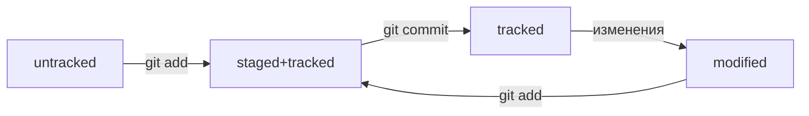

# Команды GIT

## Оглавление:

- [Установка](#установка)
- [Настройка](#настройка)
- [Инициализация](#инициализация)
- [Просмотр информации](#просмотр-информации)
- [Добавление в репозиторий](#добавление-в-репозиторий)
- [Генерация SSH-ключей](#генерация-ssh-ключей)
- [Связываем локальный и удалённый репозитории](#связываем-локальный-и-удалённый-репозитории)
- [Просмотр изменений](#просмотр-изменений)
- [Работа с ветками](#работа-с-ветками)

### Установка

- `/usr/bin/git` установка Linux/MacOS
- `brew install git` установка Homebrew
- `git version` проверить версию

### Настройка

- `git config --global` файл настроек GIT (глобальный)
- `git config --global user.name "User Namovich"` установить имя
- `git config --global user.email username@yandex.ru` установить почту

### Инициализация

- `git init` создаёт репозиторий
- `rm -rf .git` удаляет папку с репозиторием

### Просмотр информации

- `git status` выводит статус репозитория
  - `--ignored` в выводе статуса появится раздел "Ignored files"
- `git log` просмотр истории коммитов
  - `--oneline` информация о коммите в одной строке (72 символа)
  - `--all --graph` визуальный просмотр веток

`~/.gitconfig`

```
[alias]
    lg = lg1
    lg1 = lg1-specific --all
    lg2 = lg2-specific --all
    lg3 = lg3-specific --all

    lg1-specific = log --graph --abbrev-commit --decorate --format=format:'%C(bold blue)%h%C(reset) - %C(bold green)(%ar)%C(reset) %C(white)%s%C(reset) %C(dim white)- %an%C(reset)%C(auto)%d%C(reset)'
    lg2-specific = log --graph --abbrev-commit --decorate --format=format:'%C(bold blue)%h%C(reset) - %C(bold cyan)%aD%C(reset) %C(bold green)(%ar)%C(reset)%C(auto)%d%C(reset)%n'' %C(white)%s%C(reset) %C(dim white)- %an%C(reset)'
    lg3-specific = log --graph --abbrev-commit --decorate --format=format:'%C(bold blue)%h%C(reset) - %C(bold cyan)%aD%C(reset) %C(bold green)(%ar)%C(reset) %C(bold cyan)(committed: %cD)%C(reset) %C(auto)%d%C(reset)%n'' %C(white)%s%C(reset)%n'' %C(dim white)- %an <%ae> %C(reset) %C(dim white)(committer: %cn <%ce>)%C(reset)'
```

### Добавление в репозиторий

- `git add` подготовить файлы к сохранению (добавить в staged)
  - `git add .` подготовить к сохранению текущую папку со всеми файлами
- `git commit` выполнить коммит
  - `-a` добавляет изменённые файлы в staged
  - `-m` добавляет сообщение к коммиту

### Генерация SSH-ключей

- `ls -la ~/.ssh/` список созданных ключей
  - `id_ed25519` не публичный
  - `id_ed25519.pub` публичный
- `ssh-keygen -t ed25519 -C "электронная почта, к которой привязан ваш аккаунт на GitHub"` генерация SSH-ключа (алгоритм шифрования ed25519)
- `ssh-keygen -t rsa -b 4096 -C "электронная почта, к которой привязан ваш аккаунт на GitHub"` генерация SSH-ключа (другой алгоритм шифрования)
- `pbcopy < ~/.ssh/id_ed25519.pub` скопировать содержимое ключа в буфер обмена
- `ssh -T git@github.com` проверка правильности ключа привязанного к GitHub

### Связываем локальный и удалённый репозитории

- `git remote add origin git@github.com:%ИМЯ_АККАУНТА%/first-project.git` привязать удалённый репозиторий к локальному
- `git remote -v` убедиться, что репозитории связаны
- `git push -u origin main` - в первый раз загружает все коммиты из локального репозитория в удалённый с названием `origin`
- `git push` загрузить содержимое из локального репозитория в удалённый (GitHub) после того, как он был привязан с помощью флага `-u`
- `git pull` загрузить содержимое из удалённого репозитория в локальный
- `git clone` клонирует и автоматически связывает локальный репозиторий с удалённым



### Исправления коммитов

- `git commit --amend` исправить ПОСЛЕДНИЙ коммит (HEAD)
- `--no-edit` не изменять сообщение
- `-m "Новое сообщение"` изменить сообщение
- `git restore --staged <file/.>` выполнить unstage файла
- `git reset --hard <commit bash>` откатить коммит к указанному
- `git restore <file>` откатить изменения, которые не попали ни в staging, ни в коммит (возвращает файл к состоянию на последнем коммите)

### Просмотр изменений

- `git diff` просмотр изменений modified
  - `--staged` просмотр измений в staged
  - `git diff A B` просмотр изменений между двумя коммитами
  - `git diff <название*ветки1> <название*ветки2> сравнение веток
  - `~N` - суффикс навигации по коммитам.
    - `HEAD~1` — следующий за текущим коммит
      - `HEAD~` === `HEAD~1`
    - `main~1` — следующий за последним коммитом в ветке main
      - `main~` === `main~1`
    - `HEAD~5` — пятый коммит, если считать с последнего выполненного коммита
    - `main~5` — пятый коммит в ветке main, если считать с последнего выполненного коммита
    - `HEAD~0` === `HEAD` - последний коммит
    - `main~0` === `main` - последний коммит в ветке main

### Работа с ветками

- `git branch` посмотреть список веток
  - `<название_ветки>` создать новую ветку
- `git checkout <название_ветки>` перейти на указанную ветку
  - `git checkout -b <название_ветки>` создать новую ветку и перейти на неё
- `git merge <название_ветки>` - выполнит слияние ветки <название_ветки> в текущую
