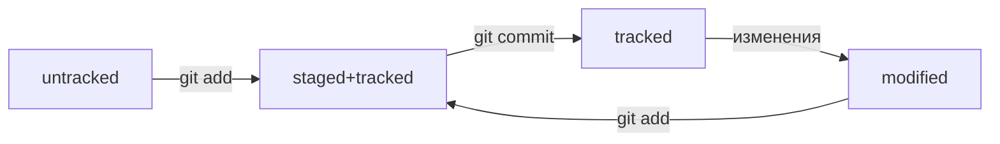

# Команды GIT

## Оглавление:

- [Установка](#установка)
- [Настройка](#настройка)
- [Инициализация](#инициализация)
- [Просмотр информации](#просмотр-информации)
- [Добавление в репозиторий](#добавление-в-репозиторий)
- [Генерация SSH-ключей](#генерация-ssh-ключей)
- [Связываем локальный и удалённый репозитории](#связываем-локальный-и-удалённый-репозитории)

### Установка

- `/usr/bin/git` установка Linux/MacOS
- `brew install git` установка Homebrew
- `git version` проверить версию

### Настройка

- `git config --global` файл настроек GIT (глобальный)
- `git config --global user.name "User Namovich"` установить имя
- `git config --global user.email username@yandex.ru` установить почту

### Инициализация

- `git init` создаёт репозиторий
- `rm -rf .git` удаляет папку с репозиторием

### Просмотр информации

- `git status` выводит статус репозитория
- `git log` просмотр истории коммитов
  - `--oneline` информация о коммите в одной строке (72 символа)
  - `--all --graph` визуальный просмотр веток
  - ```
    [alias]
      lg1 = log --graph --abbrev-commit --decorate --format=format:'%C(bold blue)%h%C(reset) - %C(bold green)(%ar)%C(reset) %C(white)%s%C(reset) %C(dim white)- %an%C(reset)%C(auto)%d%C(reset)' --all
      lg2 = log --graph --abbrev-commit --decorate --format=format:'%C(bold blue)%h%C(reset) - %C(bold cyan)%aD%C(reset) %C(bold green)(%ar)%C(reset)%C(auto)%d%C(reset)%n'' %C(white)%s%C(reset) %C(dim white)- %an%C(reset)'
      lg = lg1
    ```

### Добавление в репозиторий

- `git add` подготовить файлы к сохранению (добавить в staged)
  - `git add .` подготовить к сохранению текущую папку со всеми файлами
- `git commit` выполнить коммит
  - `-a` добавляет изменённые файлы в staged
  - `-m` добавляет сообщение к коммиту

### Генерация SSH-ключей

- `ls -la ~/.ssh/` список созданных ключей
  - `id_ed25519` не публичный
  - `id_ed25519.pub` публичный
- `ssh-keygen -t ed25519 -C "электронная почта, к которой привязан ваш аккаунт на GitHub"` генерация SSH-ключа (алгоритм шифрования ed25519)
- `ssh-keygen -t rsa -b 4096 -C "электронная почта, к которой привязан ваш аккаунт на GitHub"` генерация SSH-ключа (другой алгоритм шифрования)
- `pbcopy < ~/.ssh/id_ed25519.pub` скопировать содержимое ключа в буфер обмена
- `ssh -T git@github.com` проверка правильности ключа привязанного к GitHub

### Связываем локальный и удалённый репозитории

- `git remote add origin git@github.com:%ИМЯ_АККАУНТА%/first-project.git` привязать удалённый репозиторий к локальному
- `git remote -v` убедиться, что репозитории связаны
- `git push -u origin main` - дополнительно связываем ветки
- `git push` загрузить содержимое из локального репозитория в удалённый (GitHub)
- `git pull` загрузить содержимое из удалённого репозитория в локальный


